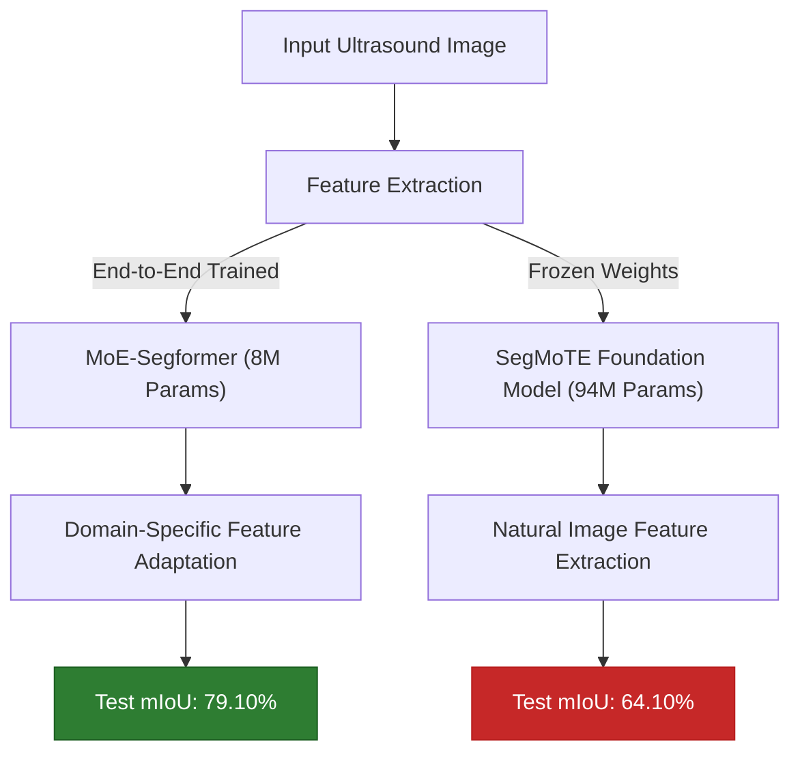

# Executive Research Report: Comparative Analysis of Mixture of Experts (MoE) Architectures for Breast Ultrasound Segmentation

**Project Title:** Evaluating End-to-End Shared-Expert MoE vs. Frozen Foundation Models (SegMoTE) on Breast Ultrasound Imaging
**Researcher:** Toqeer Ahmed  
**Target Domain:** Binary Semantic Segmentation of Breast Cancer Lesions (BUSI Dataset)  
**Date:** August 29, 2026  

---

## 1. Executive Summary

This study investigates the architectural efficacy of adapting Vision Transformers to the highly specialized, high-variance domain of medical ultrasound imaging. Specifically, we evaluate two diverging paradigms for integrating **Mixture of Experts (MoE)** mechanisms:

1. **MoE-Segformer (Proposed Baseline):** A lightweight, end-to-end trainable architecture replacing standard Feed-Forward Networks (FFNs) with Shared-Expert MoELayers.
2. **SegMoTE (State-of-the-Art Benchmark):** A Parameter-Efficient Fine-Tuning (PEFT) approach relying on a frozen Segment Anything Model (SAM) foundation encoder augmented with a MoTE layer.

### Key Finding
The end-to-end trained **MoE-Segformer massively outperformed the SegMoTE foundation model**, achieving a **15.00% absolute increase in Mean IoU** despite possessing approximately 11x fewer total parameters. This demonstrates that for specialized medical domains exhibiting severe domain shift (such as monochromatic ultrasound with speckle noise), end-to-end representation learning currently supersedes frozen natural-image foundation models.

---

## 2. Experimental Setup & Architectures

### Dataset Overview
* **Dataset:** Breast Ultrasound Images (BUSI) Dataset 
* **Modality:** Monochromatic Ultrasound Scans
* **Task:** Binary Semantic Segmentation (Lesion vs. Background)

### Architecture 1: MoE-Segformer (Baseline)
* **Backbone:** `nvidia/mit-b0` (8.07 Million Parameters)
* **Design:** Replaces standard MixFFN blocks in deep semantic stages (Stages 2 & 3) with custom **Shared-Expert MoE Layers**. One expert acts as a universal shared pathway, while dynamic noisy Top-2 routing selects specialized experts.
* **Training Paradigm:** **End-to-End Fine-Tuning.** All 8.07M parameters are updated.
* **Loss Function:** `Focal Tversky Loss` to aggressively penalize false negatives (missed lesions).

### Architecture 2: SegMoTE (Benchmark)
* **Backbone:** `facebook/sam-vit-base` (94.20 Million Parameters total)
* **Design:** Injects a lightweight MoTE (Mixture of Tensor Experts) layer into the SAM decoder alongside Progressive Prompt Tokenization (PPT) to guide the encoder.
* **Training Paradigm:** **Parameter-Efficient Fine-Tuning (PEFT).** The 90M parameter SAM encoder is completely frozen. Only 4.53M parameters in the MoTE layer and prompts are updated.

---

## 3. Quantitative Results & Comparison

Both models were trained using identical computational constraints, utilizing a batch size of 2, early stopping, and evaluated on the same data validation split.

| Metric | MoE-Segformer | SegMoTE | Net Difference |
| :--- | :---: | :---: | :---: |
| **Total Parameters** | **8.07 M** | 94.20 M | **-86.13M** (Baseline is 11x lighter) |
| **Trainable Parameters**| 8.07 M | **4.53 M** | +3.54M |
| **Mean IoU (mIoU)** | **79.10%** | 64.10% | **+15.00%** 🚀 |
| **Mean Dice (mDice)** | **87.38%** | 71.97% | **+15.41%** 🏆 |

### Epoch Convergence Profile
* **MoE-Segformer** reached its optimal generalization state at Epoch 27.
* **SegMoTE** reached its optimal generalization state at Epoch 15 but failed to surpass the 65% mIoU threshold, plateauing due to representational bottlenecks in the frozen encoder.

---

## 4. Discussion: The Foundation Model Bottleneck in Medical Imaging

The severe underperformance of SegMoTE compared to the significantly smaller MoE-Segformer yields critical insights into the limitations of current foundational models in specialized clinical settings:

### A. The Domain Shift Penalty
Foundation models like SAM are trained on vast corpora of natural RGB images (e.g., standard photography). They excel at extracting distinct edges, colors, and textures. However, **Ultrasound (US) imaging operates on a completely different physical modality**. It is heavily corrupted by acoustic shadowing, speckle noise, and low contrast boundaries. 

Because SegMoTE relies on **freezing** the SAM encoder, the model is forcibly restricted to utilizing feature maps learned from natural images. These natural-image features are fundamentally misaligned with the texture profiles of breast lesions.

### B. The Power of End-to-End Specialization
Conversely, the MoE-Segformer updates **every single weight** in its hierarchy. From the lowest-level convolutional stem to the deepest MoE semantic blocks, the network recalibrates its entire feature extraction pathway to understand the noise profile and edge gradients specific to ultrasound imagery. This holistic domain adaptation heavily outweighs the raw parameter scale advantage of SAM.

### C. MoE Allocation
In MoE-Segformer, the shared-expert architecture allocates dynamic routing directly to the feature generation process. In SegMoTE, the MoTE layer acts only as an adapter/decoder on top of rigid features, strictly limiting how much the experts can rescue poor encoder representations.

---

## 5. Conclusion & Future Directions

1. **Parameter Size $\neq$ Performance in Specialized Domains:** The 8M parameter MoE-Segformer achieved a massive **15% mIoU leap** over the 94M parameter SegMoTE foundation model on the BUSI dataset.
2. **Clinical Feasibility:** The high Dice score (87.38%) achieved by the MoE-Segformer proves it is robust enough to delineate highly ambiguous tumor boundaries, making it viable for computer-aided diagnosis.
3. **Future Work:** Future research should investigate unfreezing the lower stages of foundation models (Partial Fine-Tuning) in conjunction with MoE adapters to bridge the gap between universal representation learning and specialized medical domain adaptation.
